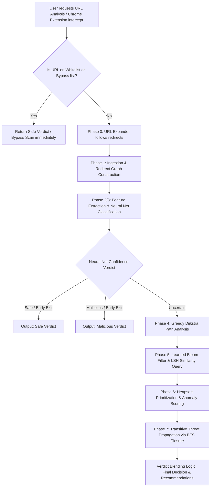
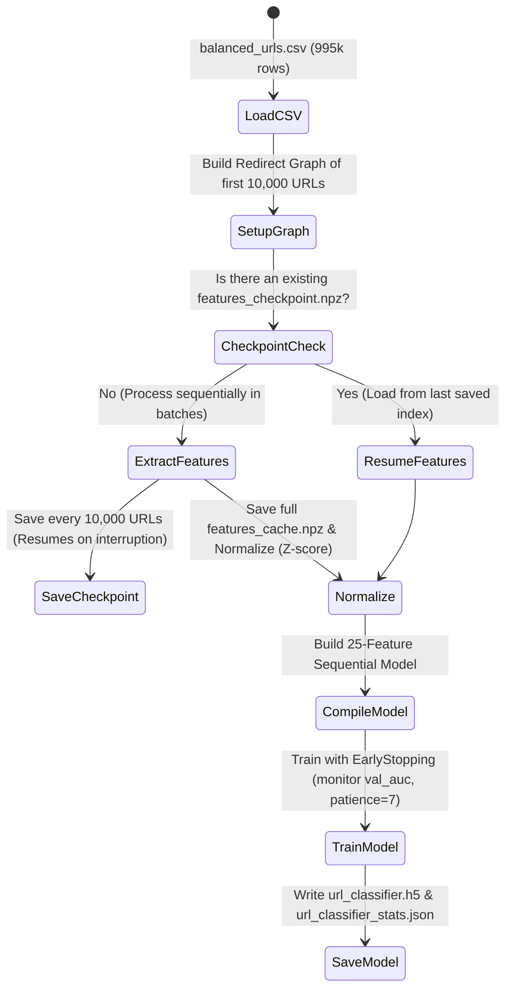

# Workflow Pipeline - Hybrid URL Detection System

This document provides a highly detailed, end-to-end trace of how a URL is processed by the **Hybrid AI-Driven Malicious URL Detection System**. It details the routing, the data transformation, the exact DAA (Design and Analysis of Algorithms) paradigms used at each stage, and how the Backend, Frontend, and Chrome Extension coordinate to protect users.

---

## 1. High-Level Architecture & End-to-End Flow

Below is the workflow pipeline diagram showing how a query traverses the system:



---

## 2. Phase-by-Phase Execution Walkthrough

### 🔗 Phase 0: URL Expansion
* **Module:** [url_expander.py](file:///Users/raghottamgirishnadgoudar/RVCE/4th_sem/DAA/Malicious_url_detection/backend/url_expander.py)
* **Goal:** Expand shortened links (e.g. `bit.ly`, `tinyurl.com`) to reveal their ultimate destination where the payload resides.
* **Mechanism:**
  * Intercepts incoming URLs and matches the domain against a static `URL_SHORTENERS` dictionary.
  * Performs lightweight HTTP `GET` requests with `allow_redirects=False` and `stream=True` (to avoid downloading files/body payload).
  * Uses the `'Connection': 'close'` header to disable connection pooling, preventing rate limiting from security-hardened servers.
  * **Fallback Scheme:** If an `https://` query fails due to SSL handshaking limits or proxy filtering, it falls back to a plain `http://` retry.
  * Blends prediction probability at the coordinator level: **65% weight** is assigned to the expanded destination and **35% weight** to the original path query signals (to capture keyword lures on shortener links).

---

### 🕸️ Phase 1: Redirect Graph & Entropy Ingestion
* **Module:** [phase1_graph_traversal.py](file:///Users/raghottamgirishnadgoudar/RVCE/4th_sem/DAA/Malicious_url_detection/backend/phase1_graph_traversal.py)
* **DAA Paradigms:** BFS, DFS, Branch & Bound Pruning, Kahn's Topological Sort.
* **Mechanism:**
  * **Shannon Entropy ($H$):** Measures character randomness of a URL string:
    $$H(URL) = - \sum_{i=1}^{n} P(x_i) \log_2 P(x_i)$$
    URLs with high entropy ($H > 4.5$) typically indicate random character generators, domain generation algorithms (DGA), or obfuscated query parameters. Low entropy ($H < 3.0$) indicates standard plain-text paths.
  * **Branch & Bound DFS:** Traverses the simulated/constructed redirect graph using iterative DFS. Branches are pruned dynamically if a node's Shannon entropy falls below $3.0$ (legitimate baseline), avoiding resource wasting on safe paths.
  * **BFS Redirect Depth:** Tracks the longest path in the redirect chain to detect evasion attempts (e.g., chain of 5+ redirects to exhaust scanner buffers).
  * **Kahn's Topological Sort:** Sorts the nodes of the DAG to establish the optimal, linear evaluation order of dependencies.

---

### 🧠 Phase 2 & 3: Feature Extraction & Neural Classification
* **Module:** [phase3_neural_classifier.py](file:///Users/raghottamgirishnadgoudar/RVCE/4th_sem/DAA/Malicious_url_detection/backend/phase3_neural_classifier.py)
* **DAA Paradigms:** Feedforward Inference with Backpropagation.
* **Mechanism:**
  * Boyer-Moore pattern matching logic (formerly Phase 2) has been fully incorporated into the feature extraction pipeline to yield a single-pass vectorizer.
  * Extracts a **25-dimensional numeric feature vector** representing:
    1. *Lexical & Structural properties:* URL/Domain length, dot count, hyphen count, subdomain depth, path depth, query param count, digit ratio, special character ratio, uppercase ratio.
    2. *Information Theory:* Shannon entropy of full URL, domain-only entropy, entropy delta from clean baselines.
    3. *Heuristics:* Presence of HTTPS, raw IP addresses, suspicious port numbers (e.g. `8080`, `3333`), homograph typosquatting matching (e.g. `g00gle.com`), and brand spoofing (e.g. `paypal.login-verification.ga` where a brand keyword exists in the subdomain but not the root domain).
    4. *Network Context:* Redirect depth and redirect chain length from Phase 1.
    5. *Domain Age Proxy:* Evaluates trusted TLDs (`.gov`, `.edu`, `.google`) vs untrusted ones (`.tk`, `.ml`, `.xyz`).
  * **Neural Net Architecture:**
    * 25 Input Units → Dense 128 (ReLU) → Batch Normalization → Dropout (30%) → Dense 64 (ReLU) → Batch Normalization → Dropout (25%) → Dense 32 (ReLU) → Batch Normalization → Dropout (20%) → 1 Output (Sigmoid).
  * **Hard-Signal Rules & Verdict Logic:**
    * If a URL matches a trusted whitelist domain (e.g., `github.com`), the classifier bypasses prediction and triggers an **Early Exit** as `Safe`.
    * Hard signals (IP address, brand spoofing, suspicious TLDs, user@domain tricks, phishing keywords) compile a composite *Hard Signal Score*. If this score $\ge 0.4$, the URL is elevated to a threat probability of $\ge 0.90$ regardless of the Neural Network's output.
    * **Action Decider:**
      * Probability $< 0.25$ $\rightarrow$ **Safe** (Early Exit)
      * Probability $> 0.88$ $\rightarrow$ **Malicious** (Early Exit & register in blacklist)
      * $0.25 \le \text{Probability} \le 0.88$ $\rightarrow$ **Uncertain** (Forward to Deep Analysis - Phases 4 to 7)

---

### 🎒 Phase 4: Greedy Optimization & Dijkstra Pathing
* **Module:** [phase4_greedy_optimization.py](file:///Users/raghottamgirishnadgoudar/RVCE/4th_sem/DAA/Malicious_url_detection/backend/phase4_greedy_optimization.py)
* **DAA Paradigms:** Dijkstra's Shortest Path, Fractional Knapsack.
* **Mechanism:**
  * **Dijkstra's Algorithm:** Calculates the shortest redirect path distance from the queried URL to any known malicious URL. It uses a min-priority queue (heapq) to traverse redirect paths efficiently:
    $$\text{Complexity: } O((V + E) \log V)$$
  * **Fractional Knapsack Scheduler:** In resource-constrained environments (e.g., bulk scanning), URLs are prioritized based on their value-to-cost ratio:
    $$\text{Value} = \text{Threat Probability} \times \text{Entropy}$$
    $$\text{Weight} = \text{Lookup Latency}$$
    Using a greedy sorting mechanism, URLs with the highest ratios are processed first until the CPU millisecond budget is fully exhausted.

---

### 🌸 Phase 5: Learned Bloom Filter with Decay Aging
* **Module:** [phase5_bloom_filter.py](file:///Users/raghottamgirishnadgoudar/RVCE/4th_sem/DAA/Malicious_url_detection/backend/phase5_bloom_filter.py)
* **DAA Paradigms:** Probabilistic Hashing, Locality-Sensitive Hashing (LSH), Backtracking Constraint Satisfaction, Dynamic Programming Decay.
* **Mechanism:**
  * **Dual Bloom Filters:**
    1. *Standard Bloom Filter ($H_1$):* Exact match blacklist for high-confidence threats.
    2. *LSH Bloom Filter ($H_2$):* Character trigrams (3-grams) extracted from URLs are inserted here. If a new URL shares $>92\%$ of its trigrams with known threat vectors, it flags a fuzzy match (catching minor typosquatting variants).
  * **Backtracking Constraint Verification:** To mitigate false positives from $H_1$/$H_2$, the system verifies that the candidate URL satisfies at least **3 out of 5** strict malicious constraints:
    1. Shannon entropy $> 4.0$
    2. Suspicious TLD suffix
    3. Phishing keyword score $> 0.1$
    4. Raw IP address in hostname
    5. Redirect depth $> 2$
  * **Exponential Decay (DP Memory Function):** To prevent blacklist bloat and handle dynamic web states, blacklist entries undergo exponential decay:
    $$\text{Effective Score}(t) = \text{Threat Score} \times e^{-\lambda (t - t_{\text{insert}})}$$
    A lazy garbage collection sweep evicts expired entries where the score drops below $0.1$.

---

### 📊 Phase 6: Heapsort Ranking & Anomaly Checking
* **Module:** [phase6_heapsort_ranking.py](file:///Users/raghottamgirishnadgoudar/RVCE/4th_sem/DAA/Malicious_url_detection/backend/phase6_heapsort_ranking.py)
* **DAA Paradigms:** Max-Heap, Heapsort, Huffman Coding.
* **Mechanism:**
  * **Heapsort:** Sorts batch scan inputs in-place with guaranteed $O(n \log n)$ time complexity and $O(1)$ space.
  * **Max-Heap Priority Extraction:** When extracting the top $k$ threats from a set of size $n$ (where $k \ll n$), the system constructs a max-heap in $O(n)$ time and extracts $k$ elements in $O(k \log n)$ time, outperforming full sorts.
  * **Huffman Coding Anomaly Detector:** Builds a Huffman tree from character distributions of benign URLs to establish an expected code length baseline:
    $$\text{Baseline Length} = \sum P(\text{char}) \times \text{Length}(\text{Huffman Code})$$
    If a queried URL's Shannon entropy deviates from this baseline by $>1.5$, it is flagged as an entropy anomaly.

---

### 🔄 Phase 7: Transitive Threat Propagation
* **Module:** [phase4_greedy_optimization.py](file:///Users/raghottamgirishnadgoudar/RVCE/4th_sem/DAA/Malicious_url_detection/backend/phase4_greedy_optimization.py)
* **DAA Paradigms:** BFS-based Transitive Closure.
* **Mechanism:**
  * Computes the transitive closure of the redirect graph.
  * If URL $A$ redirects to $B$, and $B$ transitively redirects to a known malicious URL $C$, the reachability matrix propagates the malicious classification backwards to $A$.
  * **BFS Optimization:** Instead of running the classic Floyd-Warshall algorithm which exhibits $O(V^3)$ complexity, the system performs BFS from each node, which completes in $O(V \cdot E)$ time—making it vastly superior for sparse redirection graphs.

---

## 3. Verdict Blending & Decision Tree

The final verdict and recommendation engine consolidates outputs from the neural pre-classifier, Bloom filter, and ranking components inside `determine_final_verdict` in [app.py](file:///Users/raghottamgirishnadgoudar/RVCE/4th_sem/DAA/Malicious_url_detection/backend/app.py):

| Neural Threat Prob | Bloom Verdict | Redirect Count | Final Verdict | Confidence | Recommended Action |
| :--- | :--- | :--- | :--- | :--- | :--- |
| **$< 0.25$** | Any | Any | **Safe** | High | Allow. No action needed. |
| **$\ge 0.25$** | Whitelisted | Any | **Safe** | High | Allow. Trusted domain. |
| **$> 0.88$** | Any | Any | **Malicious** | High | Block immediately. Add to blacklist. |
| Any | **`malicious`** | Any | **Malicious** | High | Block immediately. Add to blacklist. |
| **$> 0.65$** | Any | Any | **Suspicious** | Medium | Flag for manual review. |
| **$> 0.40$** | **`suspicious`** | Any | **Suspicious** | Medium | Flag for manual review. |
| **$> 0.40$** | Any | Any | **Uncertain** | Low | Allow with caution. Log for analysis. |
| **$\le 0.40$** | Any | Any | **Safe** | Medium | Likely safe. Allow. |

*Note: Shortened URLs or redirect chains exceeding 3 hops trigger a $+0.05$ penalty to their Threat Probability score to compensate for redirect-cloaking strategies.*

---

## 4. Subsystem Integration & Communication

```
┌──────────────────────────┐         CORS / JSON          ┌─────────────────────────┐
│     Chrome Extension     │ ───────────────────────────> │     Backend Service     │
│   (background/content)   │ <─────────────────────────── │ (Flask app.py / FastAPI)│
└──────────────────────────┘      Verdict & Telemetry     └─────────────────────────┘
             │                                                         │
             │ Intercepts                                              │ Loads / Writes
             ▼                                                         ▼
┌──────────────────────────┐                              ┌─────────────────────────┐
│    User's Web Browser    │                              │  Neural Model & Cache   │
│     (Tabs & Frames)      │                              │  (url_classifier.h5)    │
└──────────────────────────┘                              └─────────────────────────┘
```

1. **API Layer (`backend/app.py` & `api/app/main.py`):**
   * Exposes HTTP REST endpoints for single-URL scan (`/api/analyze`), batch processing (`/api/batch-analyze`), health checks (`/api/health`), and real-time performance profiles (`/api/analytics/performance`).
2. **React Frontend (`frontend/src/`):**
   * Uses [api.ts](file:///Users/raghottamgirishnadgoudar/RVCE/4th_sem/DAA/Malicious_url_detection/frontend/src/services/api.ts) to dispatch user requests to the backend. It parses the custom multi-phase response, translates confidence levels to UI risk score meters, and visualizes redirect chains.
3. **Chrome Extension (`chrome-extension/`):**
   * **Bypass List Guard:** Inside [background.js](file:///Users/raghottamgirishnadgoudar/RVCE/4th_sem/DAA/Malicious_url_detection/chrome-extension/background.js), the extension matches domains against `BYPASS_DOMAINS` (`localhost`, `127.0.0.1`, `::1`, `file://`, `chrome.google.com`). If matched, the extension immediately exits and colors the badge **green ("safe")** to avoid clogging the network with development-related traffic.
   * **Injection Warning:** The background worker listens to web navigation. When it receives a `Malicious` verdict, it stops the page load and redirects the tab to a local, styled [warning.html](file:///Users/raghottamgirishnadgoudar/RVCE/4th_sem/DAA/Malicious_url_detection/chrome-extension/warning.html).

---

## 5. Offline Model Training Pipeline

The offline training process in [train_model.py](file:///Users/raghottamgirishnadgoudar/RVCE/4th_sem/DAA/Malicious_url_detection/backend/train_model.py) builds the neural pre-classifier model:



---

## 6. Live Performance Benchmarking
* **Module:** [performance_benchmark.py](file:///Users/raghottamgirishnadgoudar/RVCE/4th_sem/DAA/Malicious_url_detection/backend/performance_benchmark.py)
* Benchmarks the active throughput of the pipeline by extracting samples from the dataset and measuring the execution speed of each module.
* Results are cached for 5 minutes to prevent CPU depletion on repeated queries.

### Complexity & Profiling Mapping

| Pipeline Element | Implementation Method | DAA Complexity (Theory) | Practical Latency |
| :--- | :--- | :--- | :--- |
| **Phase 0** | HTTP GET (Requests library) | $O(\text{redirects})$ | $50.0 - 200.0\text{ ms}$ (Network bound) |
| **Phase 1** | BFS/DFS traversal | $O(V + E)$ | $0.1 - 2.0\text{ ms}$ |
| **Phase 2** | Boyer-Moore (built-in Phase 3 feature) | $O(n/m)$ | $0.05 - 0.2\text{ ms}$ |
| **Phase 3** | TensorFlow Keras Inference | $O(1)$ | $0.5 - 1.2\text{ ms}$ (CPU bound) |
| **Phase 4** | Dijkstra min-priority queue | $O((V+E) \log V)$ | $0.2 - 1.5\text{ ms}$ |
| **Phase 5** | Bloom Filter + LSH trigrams | $O(k)$ | $0.02 - 0.1\text{ ms}$ |
| **Phase 6** | Heapsort Batch Ranking | $O(n \log n)$ | $0.05 - 0.5\text{ ms}$ |
| **Phase 7** | BFS Transitive Closure | $O(V \cdot E)$ | $1.0 - 5.0\text{ ms}$ |

---

## 7. Real-Time Dashboard Analytics Engine
* **Module:** [app.py](file:///Users/raghottamgirishnadgoudar/RVCE/4th_sem/DAA/Malicious_url_detection/backend/app.py)
* **DAA Paradigms:** Bounded-Space Ring Buffer, Dynamic Programming (DP) Memoization, Frequency Hash Mapping, Heapsort Exporter.
* **Mechanism:**
  * **Bounded-Space Ring Buffer:** Uses `collections.deque(maxlen=500)` to log scans. This provides $O(1)$ insertion and deletion complexity, acting as a greedy space optimizer that caps memory consumption to a strict ceiling of 500 records.
  * **DP-Style Feature Heatmap (`/api/analytics/heatmap`):** Rather than performing expensive repeated database queries or traversing lists from scratch, it memoizes the contribution of each of the 25 features scaled by the neural threat probability. The computed average values are compiled into a DP-style frequency/threat table to construct a feature risk heatmap for the frontend dashboard in $O(\text{maxlen} \times 25)$ time.
  * **Geographic/TLD Origin Hash Map (`/api/analytics/geo`):** Uses a frequency hash map ($O(N)$ lookup pre-step) to group scans by TLD and map them to their corresponding country/region of origin. It classifies threats and displays them ranked by geographical risk.
  * **Heapsort CSV Exporter (`/api/analytics/export`):** Enables exporting the scan history as a CSV file sorted in descending order of threat probability. To achieve this, it pushes entries into a min-priority queue (Python's `heapq` module) by negating the threat probabilities:
    $$\text{Complexity: } O(N \log N) \text{ time, } O(N) \text{ auxiliary space}$$
  * **Live Dashboard Statistics (`/api/analytics/stats`):** Computes aggregated counts (malicious, suspicious, uncertain, safe) and averages in a single $O(N)$ pass, feeding the frontend dashboard charts and timeline logs.
