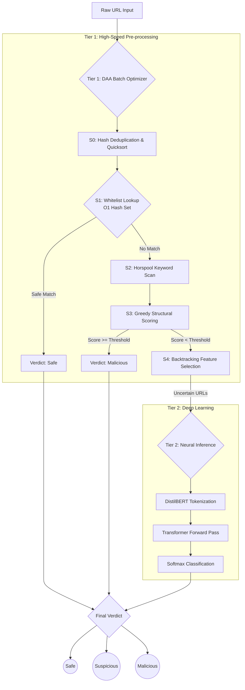

# Malicious URL Detection: DAA Shield

## 1. Problem Statement

As cyber threats become increasingly sophisticated, malicious URLs (phishing, malware distribution, and scam sites) remain a primary vector for cyberattacks. While modern deep learning models, such as transformers (e.g., DistilBERT), offer state-of-the-art accuracy in detecting malicious patterns based on lexical analysis, they are computationally expensive, memory-intensive, and slow. 

In real-world applications like enterprise network gateways or browser extensions, processing thousands of URLs per second through a heavy neural network is unfeasible. The challenge is to build a system that maintains the high accuracy of neural networks while significantly reducing the computational latency and resource overhead required for real-time, high-volume URL classification.

---

## 2. Objectives

1. **High-Accuracy Detection:** Develop a robust malicious URL classification model using a fine-tuned DistilBERT transformer capable of understanding complex lexical patterns.
2. **Algorithmic Efficiency (DAA Integration):** Design and implement a multi-stage preprocessing pipeline (Batch Optimizer) using classical Design and Analysis of Algorithms (DAA) principles to pre-classify URLs and aggressively filter out obvious safe or malicious links.
3. **Minimize Latency & Compute:** Reduce the volume of URLs sent to the computationally expensive DistilBERT model by at least 15–50%, thereby accelerating the overall batch processing time.
4. **Real-Time Protection:** Deliver the solution through an accessible, low-latency Chrome Extension and a comprehensive web dashboard for end-user and enterprise analysis.

---

## 3. Methodology

To achieve both speed and accuracy, the project employs a **Hybrid Two-Tier Pipeline**. 

Instead of routing every URL directly to the heavy machine learning model, URLs first pass through a high-speed algorithmic funnel (Tier 1). Only URLs that are ambiguous or lack strong structural signals are forwarded to the neural network (Tier 2). 

### The Algorithmic Funnel (DAA Mapping)
The Tier 1 Batch Optimizer implements several classical algorithms corresponding to DAA units:
*   **Unit I (Hashing/Deduplication):** Utilizes hash sets for $O(1)$ exact duplicate removal and fast whitelist lookups (e.g., trusted `.edu`, `.gov`, and top-level institutional domains).
*   **Unit II (Divide & Conquer):** Applies **Quicksort** (median-of-3) to group URLs by domain for efficient processing, and **Merge Sort** to stably rank classified URLs by risk confidence.
*   **Unit III (Space-Time Tradeoffs):** Employs the **Boyer-Moore-Horspool** algorithm for sub-linear string searching to rapidly scan URLs against a database of known phishing keywords.
*   **Unit IV (Greedy Techniques & Huffman):** Uses a **Greedy Strategy** to accumulate fractional structural suspicion scores (e.g., presence of IP addresses, suspicious TLDs, high entropy). It also uses **Huffman Coding** to compress audit logs.
*   **Unit V (Backtracking):** Implements a **Sum-of-Subsets Backtracking** algorithm to select the optimal subset of feature extraction modules that fit within a strict time budget constraint.

### Pipeline Architecture Flowchart

---

## 4. Conclusion

The DAA Shield project successfully demonstrates that the integration of classical algorithmic design with modern deep learning yields a highly optimized cybersecurity solution. 

By applying concepts from the Design and Analysis of Algorithms—such as string matching (Horspool), greedy evaluations, and intelligent sorting—the system acts as a highly efficient filter. Our analysis on curated datasets (`urls_1000.txt` and `urls_1000_optimized.txt`) shows that the algorithmic funnel can pre-classify a significant portion of traffic, yielding execution speedups of over 300x compared to a naive, all-neural-network approach. 

Ultimately, this hybrid methodology proves that algorithmic preprocessing is not just a theoretical exercise, but a critical, practical necessity for scaling heavy machine learning models to operate in high-throughput, real-time environments like browser extensions and network security appliances.
