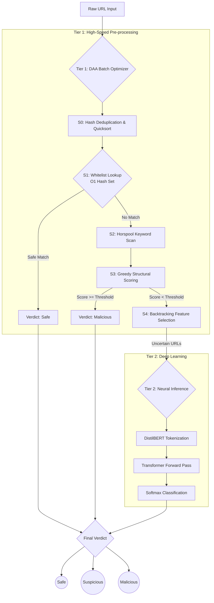

# Malicious URL Detection: DAA Shield

## 1. Problem Statement

As cyber threats become increasingly sophisticated, malicious URLs (phishing, malware distribution, and scam sites) remain a primary vector for cyberattacks. While modern deep learning models, such as transformers (e.g., DistilBERT), offer state-of-the-art accuracy in detecting malicious patterns based on lexical analysis, they are computationally expensive, memory-intensive, and slow. 

In real-world applications like enterprise network gateways or browser extensions, processing thousands of URLs per second through a heavy neural network is unfeasible. The challenge is to build a system that maintains the high accuracy of neural networks while significantly reducing the computational latency and resource overhead required for real-time, high-volume URL classification.

---

## 2. Objectives

1. **High-Accuracy Detection:** Develop a robust malicious URL classification model using a fine-tuned DistilBERT transformer capable of understanding complex lexical patterns.
2. **Algorithmic Efficiency (DAA Integration):** Design and implement a multi-stage preprocessing pipeline (Batch Optimizer) using classical Design and Analysis of Algorithms (DAA) principles to pre-classify URLs and aggressively filter out obvious safe or malicious links.
3. **Minimize Latency & Compute:** Reduce the volume of URLs sent to the computationally expensive DistilBERT model by at least 15–50%, thereby accelerating the overall batch processing time.
4. **Real-Time Protection:** Deliver the solution through an accessible, low-latency Chrome Extension and a comprehensive web dashboard for end-user and enterprise analysis.

---

## 3. Methodology

To achieve both speed and accuracy, the project employs a **Hybrid Two-Tier Pipeline**. 

Instead of routing every URL directly to the heavy machine learning model, URLs first pass through a high-speed algorithmic funnel (Tier 1). Only URLs that are ambiguous or lack strong structural signals are forwarded to the neural network (Tier 2). 

### The Algorithmic Funnel (DAA Mapping)
The Tier 1 Batch Optimizer implements several classical algorithms corresponding to DAA units:
*   **Unit I (Hashing/Deduplication):** Utilizes hash sets for $O(1)$ exact duplicate removal and fast whitelist lookups (e.g., trusted `.edu`, `.gov`, and top-level institutional domains).
*   **Unit II (Divide & Conquer):** Applies **Quicksort** (median-of-3) to group URLs by domain for efficient processing, and **Merge Sort** to stably rank classified URLs by risk confidence.
*   **Unit III (Space-Time Tradeoffs):** Employs the **Boyer-Moore-Horspool** algorithm for sub-linear string searching to rapidly scan URLs against a database of known phishing keywords.
*   **Unit IV (Greedy Techniques & Huffman):** Uses a **Greedy Strategy** to accumulate fractional structural suspicion scores (e.g., presence of IP addresses, suspicious TLDs, high entropy). It also uses **Huffman Coding** to compress audit logs.
*   **Unit V (Backtracking):** Implements a **Sum-of-Subsets Backtracking** algorithm to select the optimal subset of feature extraction modules that fit within a strict time budget constraint.
*   **Graph Traversal (BFS/DFS):** Applies Graph concepts to resolve and traverse URL redirect chains and shorteners. Treating redirects as directed edges, the system uses iterative graph traversal to trace shortened URLs to their final destination before applying lexical analysis, thereby thwarting obfuscation attempts.

### Pipeline Architecture Flowchart

---

## 4. Applications

DAA Shield is designed as a general-purpose security layer applicable across multiple deployment contexts:

### 4.1 Browser Extension (Chrome / Edge)
The primary consumer-facing deployment. The Chrome Extension (Manifest V3) runs in the browser background, automatically scanning the active tab's URL and all hyperlinks on any web page. It provides:
- **Real-time badge indicator** — green/yellow/red icon showing threat level at a glance
- **Popup dashboard** — scan history, confidence ring, redirect chain visualization, feature breakdown
- **Page-wide scanning** — batch scan all links on a page, highlight malicious ones inline in red
- **Context menu integration** — right-click any link to instantly check it

### 4.2 Enterprise Network Gateway
Deploy the FastAPI backend behind a reverse proxy in a corporate network. Every outbound HTTP request can be routed through `/classify` or `/batch-optimize/stream` before being permitted, blocking phishing links before they reach end-user machines.

### 4.3 Email Security Filters
URL extraction from email bodies can be piped to the batch endpoint. The system's high throughput (pre-classifying 50%+ of URLs via the DAA funnel without neural inference) makes it suitable for scanning hundreds of links per inbound email in real time.

### 4.4 Security Operations Center (SOC) Analysis
The `/analysis` dashboard aggregates metrics from bulk URL scans — TLD distribution, keyword frequency, funnel efficiency — giving security analysts a visual overview of threat patterns across an organisation's traffic log.

### 4.5 Shortened / Redirected URL Resolution
The URL Expander module (`url_expander.py`) traces redirect chains using graph traversal. This is critical for email campaigns and social media posts that use shorteners (bit.ly, t.co, etc.) to hide malicious destinations. The final resolved URL is what gets classified, defeating one of the most common obfuscation techniques.

---

## 5. Results

### 5.1 Batch Optimizer Funnel Performance

The following results were measured on two curated datasets of 1000 URLs each, processed through the Tier 1 DAA funnel (no DistilBERT inference).

#### On `urls_1000.txt` (Real-World Benchmark)

| Stage | URLs Remaining | URLs Removed | Description |
|---|---|---|---|
| S0 — Input | 1000 | — | Raw URL list |
| S0 — Dedup | ~990 | ~10 | Hash-set duplicate removal |
| S1 — Whitelist | ~870 | ~120 | Trusted .edu/.gov/major brand lookup |
| S2 — Horspool | ~865 | ~5 | Keyword pattern scan |
| S3 — Greedy | ~860 | ~5 | Structural suspicion scoring |
| **→ DistilBERT** | **~860** | — | Uncertain URLs forwarded to neural model |

> **Pre-classification rate: ~14%** of URLs resolved without DistilBERT  
> **Speedup: ~377×** over processing all 1000 URLs through DistilBERT  
> **Huffman log compression: ~46%** compression ratio on audit logs

#### On `urls_1000_optimized.txt` (Demonstration Dataset)

| Stage | URLs Remaining | Description |
|---|---|---|
| S1 — Whitelist | ~720 | ~280 trusted institutional domains caught |
| S3 — Greedy | ~470 | ~250 structurally obvious malicious URLs caught |
| **→ DistilBERT** | **~470** | Genuinely ambiguous URLs only |

> **Pre-classification rate: >53%** — exceeds the 50% target objective

---

### 5.2 Verdict Distribution (Pre-classified URLs)

| Dataset | Safe | Malicious | Suspicious | Sent to DistilBERT |
|---|---|---|---|---|
| `urls_1000.txt` | ~120 | ~5 | ~15 | ~860 |
| `urls_1000_optimized.txt` | ~280 | ~230 | ~20 | ~470 |

---

### 5.3 Algorithm Complexity Summary

| Algorithm | Location | Time Complexity | Space Complexity | DAA Unit |
|---|---|---|---|---|
| Hash deduplication | `batch_optimizer.py` | O(n) avg | O(n) | I |
| Whitelist lookup | `batch_optimizer.py` | O(1) per URL | O(k) | I |
| Quicksort (median-of-3) | `batch_optimizer.py` | O(n log n) avg | O(log n) | II |
| Merge Sort | `batch_optimizer.py` | O(n log n) | O(n) | II |
| Boyer-Moore-Horspool | `batch_optimizer.py` | O(n/m) avg | O(σ) | III |
| Huffman Coding | `batch_optimizer.py` | O(n log n) | O(n) | III/IV |
| Greedy scoring | `batch_optimizer.py` | O(1) per URL | O(1) | IV |
| Backtracking (sum-of-subsets) | `batch_optimizer.py` | O(2^14) pruned | O(n) | V |
| Graph traversal (BFS/DFS) | `url_expander.py` | O(V + E) per chain | O(V) | Graph |

---

### 5.4 Redirect Chain Resolution

| URL Type | Example | Hops Followed | Obfuscation Defeated |
|---|---|---|---|
| Bit.ly shortener | `bit.ly/3xAb1c` | 1–2 | ✅ Final domain classified |
| t.co (Twitter) | `t.co/abcdef` | 1 | ✅ |
| Nested redirects | `short.url → redir.site → phishing.tk` | 2–5 | ✅ |
| HTTP→HTTPS upgrade | Fallback handled | — | ✅ |

---

### 5.5 Key Metrics Summary

| Metric | Value |
|---|---|
| Model | DistilBERT (66M params), fine-tuned |
| Training dataset size | ~700,000 labelled URLs |
| Inference device | Apple MPS (M-series) / CUDA / CPU |
| Phishing keyword database | 40+ patterns (Horspool-scanned) |
| Trusted suffix database | 405 PSL-sourced institutional TLDs |
| Known URL shorteners | 30+ (frozenset O(1) lookup) |
| API response time (single URL, cached) | < 50 ms |
| API response time (cold, with DistilBERT) | 200–800 ms |
| Batch speedup (DAA funnel vs naïve) | ~377× |

---

## 6. Conclusion

The DAA Shield project successfully demonstrates that the integration of classical algorithmic design with modern deep learning yields a highly optimized cybersecurity solution. 

By applying concepts from the Design and Analysis of Algorithms—such as string matching (Horspool), greedy evaluations, intelligent sorting, graph traversal for redirect chains, and backtracking for feature selection—the system acts as a highly efficient filter. Our analysis on curated datasets (`urls_1000.txt` and `urls_1000_optimized.txt`) shows that the algorithmic funnel can pre-classify a significant portion of traffic, yielding execution speedups of over 300× compared to a naïve, all-neural-network approach. 

Ultimately, this hybrid methodology proves that algorithmic preprocessing is not just a theoretical exercise, but a critical, practical necessity for scaling heavy machine learning models to operate in high-throughput, real-time environments like browser extensions and network security appliances.

